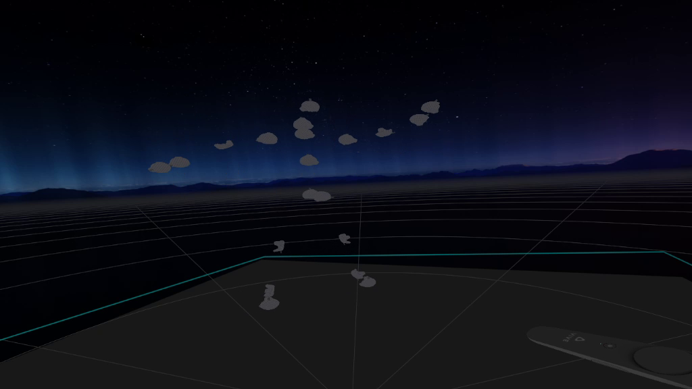
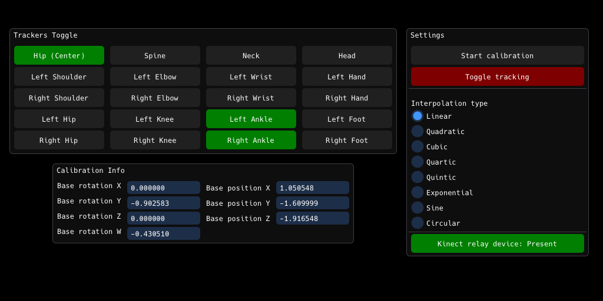

# Driver KinectV1 [](https://opensource.org/licenses/MIT)

SteamVR driver for Kinect for XBox 360.



## Features
* No additional dependencies for SteamVR.
* Configurable motion smoothing.
* Configurable amount of trackers assigned to bones.
* Works on Windows 7, 8/8.1 and 10.

## Installation
* Install [Kinect for Windows Runtime 1.8](https://www.microsoft.com/en-us/download/details.aspx?id=40277) or [Kinect for Windows SDK 1.8 (recommended)](https://www.microsoft.com/en-us/download/details.aspx?id=40278).
* Extract [latest release archive](../../releases/latest) to `<SteamVR_folder>/drivers`.
* Add line in section `steamvr` of `<Steam_folder>/config/steamvr.vrsettings` file:
  ```JSON
  "activateMultipleDrivers": true,
  ```

## Usage with dashboard

Open `KinectV1 Dashboard` from SteamVR dashboard to gain access to available settings for users:
* **Trackers toggle:** Allows you to toggle trackers for specific bones.
* **Calibration info:** Shows transformation of root point of trackers.
* **Settings:**
  * **Calibration:** Enables changing transformation of root point. After click close SteamVR dashboard and use your controllers to change rotation and position to allign trackers with your assigned body parts:
    * **Left controller's touchpad/thumbstick:** Rotate left, rotate right, rotate up, rotate down. Press grip to reset rotation.
    * **Right controller's touchpad/thumbstick:** Move right, move left, move up, move down. Press grip to reset position.
      * If trigger is pressed: move forward, move backward.
    * **Application menu button on any controller:** End calibration and save alligned base transformation.
  * **Toggle tracking:** Disable or enable tracking entirely.
  * **Interpolation type:** Sets specific interpolation between Kinect frames. More info is available at [Wikipedia's article](https://en.wikipedia.org/wiki/Interpolation).
  * **Kinect relay device state:** Shows if specific virtual base station is present.
  
## Usage with desktop version of dashboard
If you're owner of AMD GPU with latest drivers, you're in luck. Latest drivers breaks functionality of OpenGL.  
If `KinectV1 Dashboard` overlay is empty, you have to use desktop version of dashboard included in release.  
Before you launch `kinect_dash_desktop` from `SteamVR/drivers/kinectV1/bin/win##`, you have to kill `kinect_dash` process from task manager/CMD/PowerShell console.  
Alternative, you can swap names of `kinect_dash` and `kinect_dash_desktop`.

## Building
* Install [Kinect for Windows SDK 1.8](https://www.microsoft.com/en-us/download/details.aspx?id=40278).
* Clone repository using `git`.
* Initialize submodules
```
git submodule update --init --depth=1
```
* Open `driver_kinectV1.sln` in Visual Studio 2013.

## Credits
* Thanks to **@Holiks-Serbuchev** for testing and debugging on real device.
